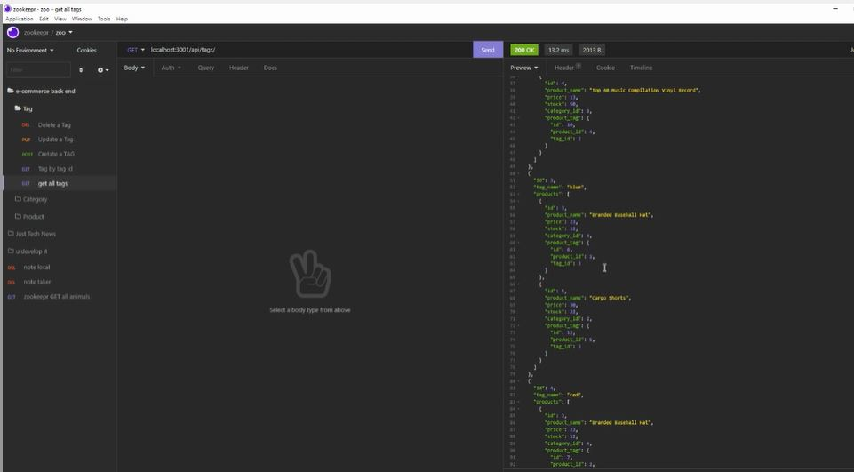

# e-commerce-back-end

 

## Purpose
A back end service that uses the latest technologie to serve a e-commerce website.

## Built with
* Javascript
* NPM Packages 
  * mysql2
  * sequelize
  * dotenv 

## Application

We use insomnia application to test the different GET, Post, Put and Delete Routes.

[Video of a demonstration part 1](https://watch.screencastify.com/v/v1WngtABTPTFzbPpAUCE)

[Video of a demonstration part 2](https://watch.screencastify.com/v/ILZzGYbhEZE9W40PTw7e)

## GitHub Repository

https://github.com/Benitocr/e-commerce-back-end

## Contribution
2022  by [Benito Cavazos](https://github.com/Benitocr)